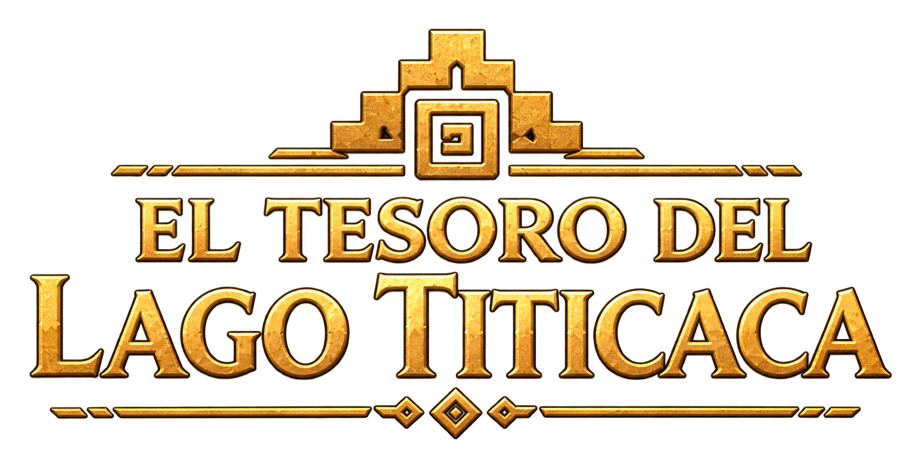
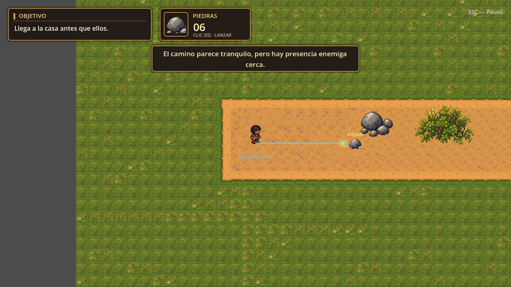
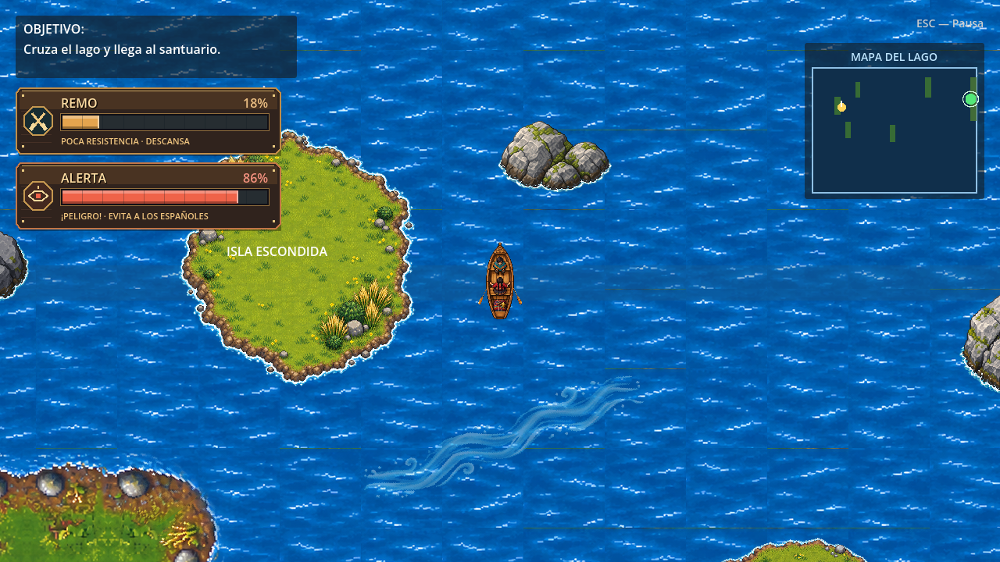

<div align="center">



### Una aventura de sigilo y navegación en el lago sagrado


</div>

**El Tesoro del Lago Titicaca** es un videojuego 2D de aventura ambientado en una historia sobre Pasco, Huita y un tesoro perseguido por soldados españoles. La primera parte combina exploración y sigilo en tierra; la segunda lleva la huida al lago, entre corrientes, rocas y barcas enemigas, hasta llegar al santuario.

<div align="center">


*El santuario al final de la travesía.*

</div>

## Tecnologías

<div align="center">

[](https://godotengine.org/)
[](https://docs.godotengine.org/en/stable/tutorials/scripting/gdscript/index.html)
[](https://webassembly.org/)
[](https://developer.mozilla.org/es/docs/Web/HTML)
[](https://developer.mozilla.org/es/docs/Web/CSS)
[](https://developer.mozilla.org/es/docs/Web/JavaScript)
[](https://vercel.com/)

</div>

El juego está hecho en **Godot 4.7** con **GDScript**. La versión para navegador usa la exportación web de Godot, que genera archivos **WebAssembly**, una plantilla **HTML/CSS/JavaScript** y recursos estáticos que se publican en **Vercel**. No se necesita Node.js ni un servidor de aplicación para ejecutar el juego.

## El juego

| Nivel 1 · El poblado | Nivel 2 · El lago |
|:---:|:---:|
| Explora el camino, habla con Huita, evita a los soldados y recupera el tesoro. | Rema entre islas, corrientes y patrullas hasta alcanzar el santuario. |
|  |  |

- **Sigilo y distracción:** las piedras permiten desviar o derribar soldados sin dañar a los habitantes del poblado.
- **Un pueblo con vida:** casas y personajes locales acompañan el recorrido de Pasco.
- **Travesía con tensión:** la barca tiene resistencia de remo; las corrientes, rocas y patrullas cambian la ruta.
- **Historia audiovisual:** incluye música, efectos, cinemática de apertura y un vídeo final que se puede saltar.
- **Juego móvil en navegador:** controles táctiles y aviso para jugar con el teléfono en horizontal.

## Controles

| Acción | Teclado y ratón | Móvil |
|---|---|---|
| Mover a Pasco o dirigir la barca | `WASD` o flechas | Joystick táctil |
| Correr o remar rápido | `Shift` | Botón de carrera / remo |
| Interactuar y avanzar diálogos | `E` o `Enter` | Botón **ACCIÓN** |
| Apuntar y lanzar una piedra | Ratón y clic izquierdo | Control táctil de lanzamiento |
| Pausar | `Esc` | Botón **PAUSA** |
| Activar o silenciar el sonido | `M` o botón de sonido | Botón de sonido |
| Saltar una cinemática | Botón **SALTAR CINEMÁTICA** o `Esc` | Botón **SALTAR CINEMÁTICA** |

## Ejecutar el proyecto

1. Instala **Godot 4.7**.
2. Abre Godot e importa el archivo [`project.godot`](project.godot).
3. Pulsa **F5** para ejecutar el juego desde el menú principal.

La escena inicial es [`MainMenu.tscn`](scenes/main/MainMenu.tscn). Desde el menú se puede comenzar la historia o entrar directamente a la travesía del lago.

## Publicar la versión web en Vercel

La exportación web ya está configurada en [`export_presets.cfg`](export_presets.cfg) y sus archivos se generan en [`web/`](web/). La configuración de Vercel está en [`vercel.json`](vercel.json).

Después de modificar el juego, vuelve a exportar desde **Proyecto → Exportar → Web → Exportar proyecto**, con destino `web/index.html`. También puedes hacerlo desde una terminal donde `godot` esté disponible:

```bash
godot --headless --path . --export-release Web web/index.html
```

En Vercel, importa el repositorio y usa estos valores:

| Ajuste | Valor |
|---|---|
| Preset | **Other** |
| Root Directory | `./` |
| Build Command | Vacío |
| Install Command | Vacío |
| Output Directory | `web` (ya definido en `vercel.json`) |

La publicación toma los archivos exportados de `web/`. Cuando cambies escenas, scripts, audio o vídeo, **genera de nuevo la exportación web** antes de publicar esos cambios.

## Estructura del proyecto

```text
assets/          Sprites, escenarios, música, efectos y vídeos
scenes/          Menú, niveles, personajes, enemigos e interfaz
scripts/         Mecánicas, IA, controles y flujo de escenas
tests/           Pruebas automatizadas de las mecánicas principales
docs/previews/   Capturas y vistas previas del juego
web/             Exportación estática para el navegador
web_template/    Plantilla HTML de la versión web y móvil
```

## Estado del proyecto

El juego está en fase **alpha**. Los dos niveles, los controles de escritorio y móvil, las cinemáticas y la exportación web están implementados. El vídeo final suministrado se reproduce al llegar al santuario; al terminar o saltarlo aparece la pantalla de cierre.

<div align="center">

**Pasco y Huita · El Tesoro del Lago Titicaca**

</div>
